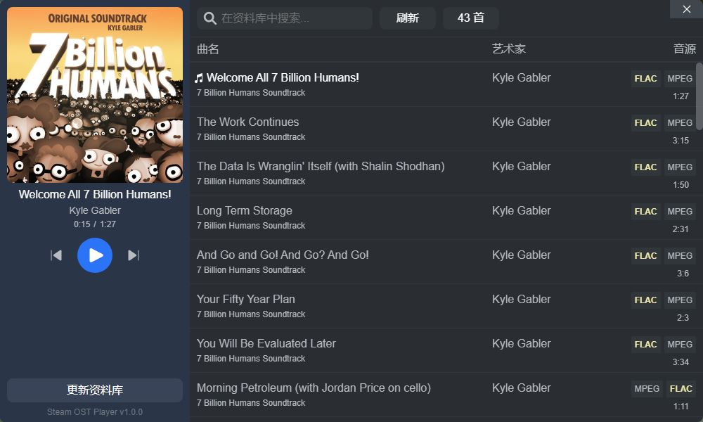

# Steam OST Player

Steam 原声配乐(OST)播放器, 与 Steam 资源库无缝连接, 支持自动从 Steam 资源库读取 OST.

## 使用方法

1. 下载安装包后解压在任意目录
2. 双击 `Steam OST Player.exe` 运行
3. 点击应用左下角 `更新资料库` 按钮
4. 更新完成后在右侧列表点击即可播放

> 若出现更新资料库完成但右侧列表任然为空, 可点击顶部的 `刷新` 按钮手动刷新列表

## 更新应用

当前暂不支持自动更新, 请在 `Releases` 下载最新版本后覆盖即可.

数据库文件存储在 `C:\Users\当前用户\AppData\Roaming\steam-ost-player/sop.db`, 而 OST 文件存储在 Steam 资料库中

## 功能计划

* [x] 自动发现 Steam OST (1.0.0+)
* [x] MP3、FLAC 播放 (1.0.0+)
* [x] 媒体数据解析 (1.0.0+)
* [x] 自动获取封面 (1.0.0+)
* [x] 后台播放 (1.0.0+)
* [x] 单曲循环 (1.0.1+)
* [x] 随机播放 (1.0.1+)
* [x] 三段式音量控制 (1.0.1+)
* [ ] 自定义合集
* [ ] 收藏音乐
* [ ] 频谱可视化
* [ ] 音乐风格分析
* [ ] 应用版本检测与更新

## 已知问题

* [x] 播放器已播时间不准 -> 暂时推后 -> 已修复
* [ ] 更新资料库时内存占用飙升(实测最高1G) -> 待修复

## 文件结构

* /basic · · · · · · · · · · · · · · · > Electron 基础脚本
* /basic/main · · · · · · · · · ·> 主脚本
* /basic/preload · · · · · · · > 预加载脚本
* /core · · · · · · · · · · · · · · · ·> 核心脚本
* /core/databse.js · · · · · ··> 数据库脚本
* /core/player.js · · · · · · · ·> 播放器脚本
* /core/scan-library.js · · ·> 扫描资源库脚本
* /core/window.js · · · · · · > 窗口控制脚本
* /other · · · · · · · · · · · · · · ··> 其他资源与脚本
* /other/build · · · · · · · · · ·> 构建所需资源文件
* /other/scripts · · · · · · · · ·> 运行调试所需文件
* /other/version · · · · · · · ··> 版本管理所需文件
* /page · · · · · · · · · · · · · · · ·> 应用界面

## 鸣谢

* [find-install-path](https://www.npmjs.com/package/find-install-path): 查找应用程序安装位置
* [music-metadata](https://www.npmjs.com/package/music-metadata): 媒体数据解析
* [sqlite3](https://www.npmjs.com/package/sqlite3): SQLite3 数据库
* [audiomotion-analyzer](https://www.npmjs.com/package/audiomotion-analyzer): 实时音频频谱分析